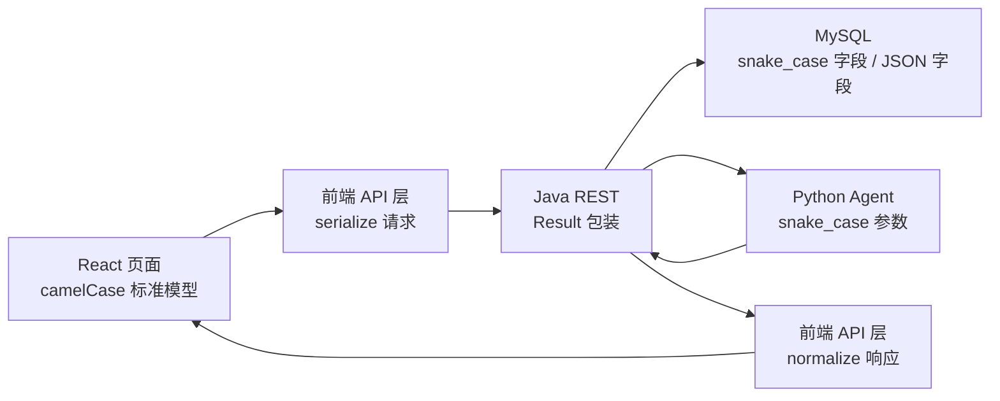

# Frontend Data Contract

本文档用于对齐前端、Java 后端、Agent 和 SQL 存储之间的数据格式。当前前端以 `cdc-frontend/src/api/normalize.js` 作为唯一数据契约入口。

## 1. 数据链路



页面层只使用 camelCase 标准模型；后端/Agent/SQL 字段差异都收敛在 API 层。

## 2. 前端标准模型

### ArticleSummary

```json
{
  "id": 1,
  "requestId": 10,
  "entityName": "白破疫苗",
  "entityType": 2,
  "templateName": "通知公告版",
  "status": 4,
  "mode": 1,
  "modifyCount": 0,
  "createTime": "2026-06-19T14:40:00",
  "updateTime": "2026-06-19T14:45:00",
  "userText": ""
}
```

### ArticleDetail

```json
{
  "id": 1,
  "requestId": 10,
  "templateId": 1,
  "outline": "# 一、接种安排",
  "initialDraft": "正文 Markdown",
  "finalArticle": "终稿 Markdown",
  "status": 4,
  "coverImage": "/api/uploads/images/a.jpg",
  "images": [],
  "qualityScore": null,
  "readabilityLevel": "",
  "generationMeta": null,
  "createTime": "2026-06-19T14:40:00",
  "updateTime": "2026-06-19T14:45:00"
}
```

### ArticleImage

```json
{
  "id": 1,
  "articleId": 1,
  "imageKey": "img_001",
  "filePath": "/api/uploads/images/xxx.jpg",
  "caption": "图片说明",
  "position": 0,
  "generatedBy": "SenseNova-U1-Lite",
  "generationPrompt": "生成提示词",
  "width": 1024,
  "height": 768,
  "fileSize": 123456,
  "status": 1,
  "createdAt": "2026-06-19T14:40:00",
  "updatedAt": "2026-06-19T14:45:00"
}
```

### Template

```json
{
  "id": 1,
  "templateName": "通知公告版",
  "tag": "疫苗接种",
  "purpose": "用于接种通知",
  "tone": "",
  "outlineStructure": "[\"标题\",\"背景\",\"安排\",\"注意事项\"]",
  "status": 1,
  "createTime": "2026-06-19T14:40:00"
}
```

### WikiEntity

```json
{
  "id": 1,
  "entityType": 2,
  "stdName": "白破疫苗",
  "alias": "[\"百白破疫苗\"]",
  "aliasList": ["百白破疫苗"],
  "summary": "基础说明",
  "segments": [],
  "rules": [],
  "relatedIds": [],
  "createTime": "2026-06-19T14:40:00",
  "updateTime": "2026-06-19T14:45:00"
}
```

## 3. 字段映射规则

| 领域 | 前端标准字段 | Java JSON 字段 | SQL 字段 | Agent 字段 |
| --- | --- | --- | --- | --- |
| 文章 ID | `articleId` | `articleId` | `article_id` | `article_id` |
| 请求 ID | `requestId` | `requestId` | `request_id` | - |
| 模板 ID | `templateId` | `templateId` | `template_id` | `template_id` |
| 实体类型 | `entityType` | `entityType` | `entity_type` | `entity_type` |
| 用户文本 | `userText` | `userText` | `user_text` | `user_text` |
| 初稿 | `initialDraft` | `initialDraft` | `initial_draft` | `initial_draft` |
| 终稿 | `finalArticle` | `finalArticle` | `final_article` | `final_article` |
| 图片 Key | `imageKey` | `imageKey` | `image_key` | `image_key` |
| 图片路径 | `filePath` | `filePath` | `file_path` | `file_path` |
| 生成模型 | `generatedBy` | `generatedBy` | `generated_by` | `generated_by` |
| 模板大纲 | `outlineStructure` | `outlineStructure` | `outline_structure` | `template_outline` |

## 4. 空值和类型规则

| 类型 | 前端标准 |
| --- | --- |
| 文本 | 空值统一为 `""` |
| 数字 ID | 可选 ID 为空时为 `null` |
| 状态字段 | 业务默认值，如图片 `status=1`、模板 `status=1` |
| 列表 | 空值统一为 `[]` |
| 分页 | 固定 `{ list, total, page, size, totalPages }` |
| Markdown 文本 | 入站统一换行符，页面不再处理 `\r\n` 差异 |
| 图片路径 | 入站统一经 `normalizeImageSrc()` 转为可访问路径 |

## 5. 已落地的前端适配

- `normalize.js`：集中提供 `normalize*` 和 `serialize*` 方法。
- `article.js`：创建文章、自由文本创建、表单下拉、意图解析、详情/列表/上下文统一标准化。
- `gallery.js`：配图保存/更新/批量保存使用 `serializeGalleryImage()`；Agent 生成图使用 snake_case 参数。
- `template.js`：模板列表、分页、详情入站标准化；新增/更新出站序列化。
- `wiki.js`：实体、片段、规则入站标准化；新增/更新出站序列化。
- `llmConfig.js`：LLM 配置入站标准化；新增/更新出站序列化。

## 6. 后端协同建议

1. Java REST 对前端继续暴露 camelCase JSON，内部 MyBatis 映射 SQL snake_case。
2. Agent 接口保持 snake_case；Java 后端负责转换，不建议页面直接拼 Agent 字段，除 `/api/agent/*` 代理接口外。
3. JSON 字段建议固定结构：
   - `cdc_article.images`: `ArticleImage[]` 的快照，可选，主数据仍以 `cdc_article_image` 为准。
   - `cdc_article.generation_meta`: `{ "model": "", "totalTokens": 0, "totalCostMs": 0, "retryCount": 0 }`
   - `cdc_agent_trace.token_usage`: `{ "prompt": 0, "completion": 0, "total": 0 }`
4. 后端分页接口统一返回 `{ list, total, page, size, totalPages }`。
5. 文本字段不要返回字符串 `"null"`；空文本返回 `null` 或 `""` 均可，前端会归一为 `""`。

## 7. 修改文件清单

本次前端数据格式统一涉及：

- `cdc-frontend/src/api/normalize.js`
- `cdc-frontend/src/api/article.js`
- `cdc-frontend/src/api/gallery.js`
- `cdc-frontend/src/api/template.js`
- `cdc-frontend/src/api/wiki.js`
- `cdc-frontend/src/api/llmConfig.js`
- `docs/FRONTEND_DATA_CONTRACT.md`
